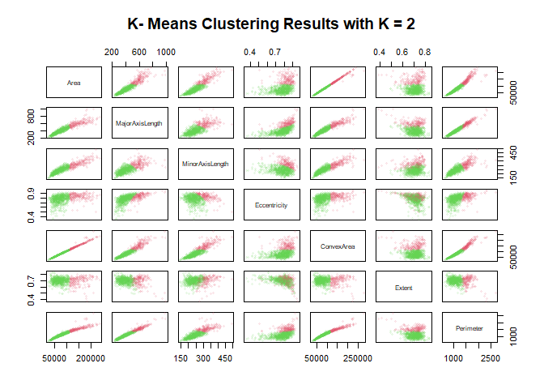

```r
data = read.csv('datasets/Raisin_Dataset.csv', sep = ';')
table(data$Class_literal)
```

```
## 
##   Besni Kecimen 
##     450     450
```

We exclude the label variable

```r
df = data[-c(8, 9)]
head(df)
```

```
##    Area MajorAxisLength MinorAxisLength Eccentricity ConvexArea    Extent
## 1 87524        442.2460        253.2912    0.8197384      90546 0.7586506
## 2 75166        406.6907        243.0324    0.8018052      78789 0.6841296
## 3 90856        442.2670        266.3283    0.7983536      93717 0.6376128
## 4 45928        286.5406        208.7600    0.6849892      47336 0.6995994
## 5 79408        352.1908        290.8275    0.5640113      81463 0.7927719
## 6 49242        318.1254        200.1221    0.7773513      51368 0.6584564
##   Perimeter
## 1  1184.040
## 2  1121.786
## 3  1208.575
## 4   844.162
## 5  1073.251
## 6   881.836
```


```r
km.out = kmeans(df, 2)
km.out
```

```
## K-means clustering with 2 clusters of sizes 189, 711
## 
## Cluster means:
##        Area MajorAxisLength MinorAxisLength Eccentricity ConvexArea    Extent
## 1 150233.37        605.4126        322.4120    0.8333862  156300.93 0.6945978
## 2  71209.01        384.5485        236.4324    0.7677608   73877.08 0.7008132
##   Perimeter
## 1  1583.103
## 2  1055.006
## 
## Clustering vector:
##   [1] 2 2 2 2 2 2 2 2 2 2 2 2 2 2 2 2 2 2 2 2 2 2 2 2 2 2 2 2 2 2 2 2 2 2 2 2 2
##  [38] 2 2 2 2 2 2 2 2 2 2 2 2 2 2 1 2 2 2 2 2 2 2 2 2 2 2 2 2 2 2 2 2 2 2 2 2 2
##  [75] 2 2 2 2 2 2 2 2 2 2 2 1 2 2 2 2 2 2 2 2 2 2 2 2 2 2 2 2 2 2 2 2 2 2 2 2 2
## [112] 2 2 2 2 2 2 2 2 2 2 2 2 2 2 2 2 2 2 2 2 2 2 2 2 2 2 2 2 2 2 2 2 2 2 2 2 2
## [149] 2 2 2 2 2 2 2 2 2 2 2 2 2 2 2 2 2 2 2 2 2 2 2 2 2 2 2 2 2 2 2 2 2 2 2 2 2
## [186] 2 2 2 2 2 2 2 2 2 2 2 2 2 2 2 2 2 2 2 2 2 2 2 2 2 2 2 2 2 2 2 2 2 2 2 2 2
## [223] 2 2 2 2 2 2 2 2 2 2 2 2 2 2 2 2 2 2 2 2 2 2 2 2 2 2 2 2 2 2 2 2 2 2 2 2 2
## [260] 2 2 2 2 2 2 2 2 2 2 2 2 2 2 2 2 2 2 2 2 2 2 2 2 2 2 2 2 2 2 2 1 2 2 2 2 2
## [297] 2 2 2 2 2 2 2 2 2 2 2 2 2 2 2 2 2 2 2 2 2 2 2 2 2 2 2 2 2 2 2 2 2 2 2 2 2
## [334] 2 2 2 2 2 2 2 2 2 2 2 2 2 2 2 2 2 2 2 2 2 2 2 2 2 2 2 2 2 2 2 2 2 2 2 2 2
## [371] 2 2 2 2 2 2 2 2 2 2 2 2 2 2 2 2 2 2 2 2 2 2 2 2 2 2 2 2 2 2 2 2 2 2 2 2 2
## [408] 2 2 2 2 2 2 2 2 2 2 2 2 2 2 2 2 2 2 2 2 2 2 2 2 2 2 2 2 2 2 2 2 2 2 2 2 2
## [445] 2 2 2 2 2 2 1 1 2 2 2 1 1 1 1 2 2 2 1 2 1 2 2 1 1 1 2 1 2 1 2 1 1 2 1 1 1
## [482] 2 1 2 1 2 2 1 2 2 1 2 2 2 2 1 1 2 1 2 1 1 2 1 2 2 1 1 1 1 2 2 2 2 1 1 1 2
## [519] 2 2 1 2 1 1 2 1 2 1 1 2 2 2 2 1 1 2 2 2 1 2 1 1 1 1 2 2 2 1 1 2 2 2 1 2 2
## [556] 1 2 2 2 1 1 1 2 1 2 1 1 1 1 2 2 2 2 1 1 1 2 1 1 1 1 1 1 1 2 2 1 2 1 2 1 2
## [593] 1 1 1 2 2 2 2 1 2 1 2 1 2 1 2 2 2 1 2 2 1 1 2 2 1 1 2 2 2 1 1 1 2 2 2 2 2
## [630] 2 2 2 2 2 1 2 2 1 2 2 2 1 2 2 1 1 2 2 2 1 1 2 2 2 1 2 1 1 2 2 2 1 2 2 2 2
## [667] 1 2 1 2 1 1 2 2 2 1 2 1 1 1 2 1 2 2 2 2 2 1 2 2 2 1 1 2 1 2 2 2 2 1 1 1 1
## [704] 1 1 2 2 2 1 2 2 1 2 2 2 2 2 2 2 2 2 2 1 2 2 2 2 1 2 2 2 2 2 2 2 1 1 2 1 2
## [741] 2 1 2 2 2 2 1 1 2 2 2 1 2 2 1 1 1 2 2 1 1 2 2 2 2 1 2 1 1 1 1 1 2 2 2 2 1
## [778] 1 1 2 2 1 2 2 2 2 1 2 1 2 2 1 2 2 2 2 2 2 2 2 1 1 2 1 1 2 1 2 2 2 1 2 1 1
## [815] 2 1 2 2 2 2 1 1 2 2 2 2 2 2 2 1 1 2 2 2 1 2 1 1 2 2 2 2 2 2 2 1 2 1 2 2 2
## [852] 2 2 1 2 1 1 1 2 1 1 2 2 2 1 1 1 2 1 2 1 2 2 2 2 2 1 1 1 2 1 1 2 1 2 2 1 2
## [889] 2 2 2 2 1 1 1 2 2 2 2 2
## 
## Within cluster sum of squares by cluster:
## [1] 345272914401 569761126243
##  (between_SS / total_SS =  68.0 %)
## 
## Available components:
## 
## [1] "cluster"      "centers"      "totss"        "withinss"     "tot.withinss"
## [6] "betweenss"    "size"         "iter"         "ifault"
```


```r
plot (df, col = adjustcolor(km.out$cluster + 1, alpha.f = 0.1),
main = "K- Means Clustering Results with K = 2", pch = 20)
```

<!-- -->
