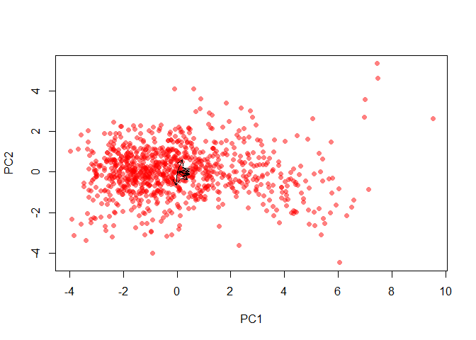
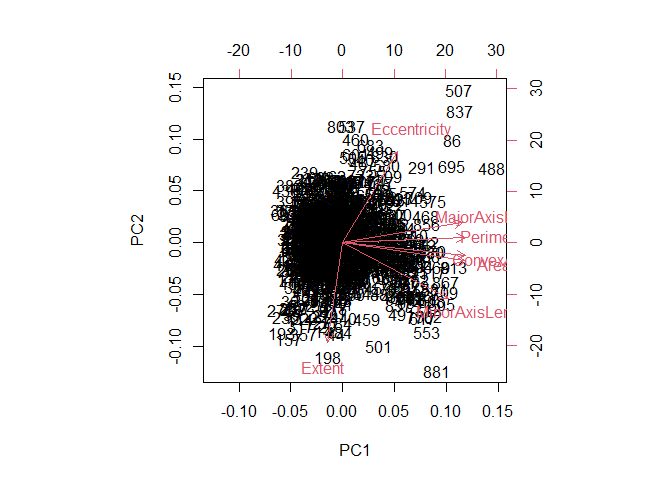
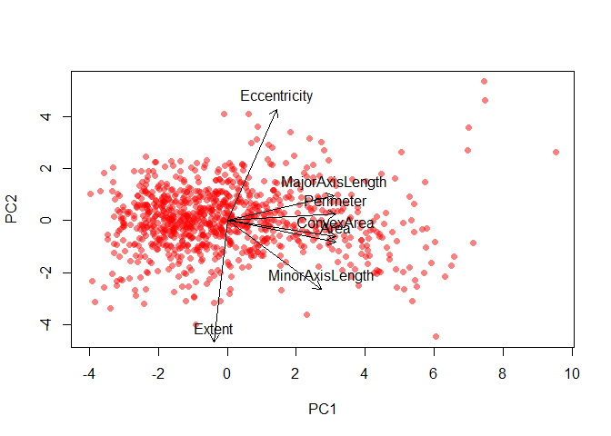

```r
data = read.csv('datasets/Raisin_Dataset.csv', sep = ';')
```

We exclude the label variable

```r
df = data[-c(8, 9)]
head(df)
```

```
##    Area MajorAxisLength MinorAxisLength Eccentricity ConvexArea    Extent
## 1 87524        442.2460        253.2912    0.8197384      90546 0.7586506
## 2 75166        406.6907        243.0324    0.8018052      78789 0.6841296
## 3 90856        442.2670        266.3283    0.7983536      93717 0.6376128
## 4 45928        286.5406        208.7600    0.6849892      47336 0.6995994
## 5 79408        352.1908        290.8275    0.5640113      81463 0.7927719
## 6 49242        318.1254        200.1221    0.7773513      51368 0.6584564
##   Perimeter
## 1  1184.040
## 2  1121.786
## 3  1208.575
## 4   844.162
## 5  1073.251
## 6   881.836
```


```r
options(scipen = 10)
round((apply(df, 2, mean)), digits = 5); round((apply(df, 2, var)), digits = 5)
```

```
##            Area MajorAxisLength MinorAxisLength    Eccentricity      ConvexArea 
##     87804.12778       430.92995       254.48813         0.78154     91186.09000 
##          Extent       Perimeter 
##         0.69951      1165.90664
```

```
##             Area  MajorAxisLength  MinorAxisLength     Eccentricity 
## 1521164692.88354      13464.14922       2498.89029          0.00816 
##       ConvexArea           Extent        Perimeter 
## 1662135017.86620          0.00286      74946.90040
```

```r
summary(df)
```

```
##       Area        MajorAxisLength MinorAxisLength  Eccentricity   
##  Min.   : 25387   Min.   :225.6   Min.   :143.7   Min.   :0.3487  
##  1st Qu.: 59348   1st Qu.:345.4   1st Qu.:219.1   1st Qu.:0.7418  
##  Median : 78902   Median :407.8   Median :247.8   Median :0.7988  
##  Mean   : 87804   Mean   :430.9   Mean   :254.5   Mean   :0.7815  
##  3rd Qu.:105028   3rd Qu.:494.2   3rd Qu.:279.9   3rd Qu.:0.8426  
##  Max.   :235047   Max.   :997.3   Max.   :492.3   Max.   :0.9621  
##    ConvexArea         Extent         Perimeter     
##  Min.   : 26139   Min.   :0.3799   Min.   : 619.1  
##  1st Qu.: 61513   1st Qu.:0.6709   1st Qu.: 966.4  
##  Median : 81651   Median :0.7074   Median :1119.5  
##  Mean   : 91186   Mean   :0.6995   Mean   :1165.9  
##  3rd Qu.:108376   3rd Qu.:0.7350   3rd Qu.:1308.4  
##  Max.   :278217   Max.   :0.8355   Max.   :2697.8
```


```r
pr.out = prcomp(df, scale = TRUE)
pr.out
```

```
## Standard deviations (1, .., p=7):
## [1] 2.19824671 1.20548266 0.79274805 0.23837893 0.14767623 0.08018847 0.03178852
## 
## Rotation (n x k) = (7 x 7):
##                         PC1         PC2          PC3        PC4         PC5
## Area             0.44828422 -0.11609991  0.005483783 -0.1111391 -0.61104765
## MajorAxisLength  0.44323980  0.13658724 -0.100547975  0.4952046  0.08757032
## MinorAxisLength  0.38938118 -0.37492246  0.236043538 -0.6558767  0.38457775
## Eccentricity     0.20297098  0.61082321 -0.628522057 -0.4262986  0.07510412
## ConvexArea       0.45093833 -0.08761633  0.036672403  0.0558117 -0.39241075
## Extent          -0.05636836 -0.66734439 -0.731980930  0.1090526  0.05685884
## Perimeter        0.45082374  0.03417227  0.044300766  0.3398651  0.55515080
##                         PC6         PC7
## Area             0.09983439  0.62436686
## MajorAxisLength  0.68557712 -0.22772863
## MinorAxisLength  0.23903320 -0.12995283
## Eccentricity    -0.05356014 -0.02044403
## ConvexArea      -0.47120104 -0.63914127
## Extent          -0.02345199  0.00161639
## Perimeter       -0.48726906  0.36399975
```

```r
summary(pr.out)
```

```
## Importance of components:
##                           PC1    PC2     PC3     PC4     PC5     PC6     PC7
## Standard deviation     2.1982 1.2055 0.79275 0.23838 0.14768 0.08019 0.03179
## Proportion of Variance 0.6903 0.2076 0.08978 0.00812 0.00312 0.00092 0.00014
## Cumulative Proportion  0.6903 0.8979 0.98770 0.99582 0.99894 0.99986 1.00000
```


Correct dimensions, show clearly the points but it is not readable

```r
plot(pr.out$x[, 1], pr.out$x[, 2], type = "n", xlab = "PC1", ylab = "PC2")  
points(pr.out$x[, 1], pr.out$x[, 2], col = rgb(1, 0, 0, alpha = 0.5), pch = 16) 
arrows(0, 0, pr.out$rotation[, 1], pr.out$rotation[, 2], length = 0.1, angle = 30)
```

<!-- -->


Shows both the dimension and the arrows' label, but not the points

```r
biplot(pr.out)
```

<!-- -->


Compromise, arrows length increased

```r
plot(pr.out$x[, 1], pr.out$x[, 2], type = "n", xlab = "PC1", ylab = "PC2") 
points(pr.out$x[, 1], pr.out$x[, 2], col = rgb(1, 0, 0, alpha = 0.5), pch = 16)  
arrows(0, 0, pr.out$rotation[, 1]*7, pr.out$rotation[, 2]*7, length = 0.1, angle = 30)
text(pr.out$rotation[, 1]*7, pr.out$rotation[, 2]*7, labels = rownames(pr.out[[2]]), pos = 3)
```

<!-- -->


