```r
library(ggplot2)
```


```r
data = read.csv('datasets/Raisin_Dataset.csv', header=TRUE, sep=";")
```


```r
table(data$Class_literal)
```

```
## 
##   Besni Kecimen 
##     450     450
```


```r
summary(data)
```

```
##       Area        MajorAxisLength MinorAxisLength  Eccentricity   
##  Min.   : 25387   Min.   :225.6   Min.   :143.7   Min.   :0.3487  
##  1st Qu.: 59348   1st Qu.:345.4   1st Qu.:219.1   1st Qu.:0.7418  
##  Median : 78902   Median :407.8   Median :247.8   Median :0.7988  
##  Mean   : 87804   Mean   :430.9   Mean   :254.5   Mean   :0.7815  
##  3rd Qu.:105028   3rd Qu.:494.2   3rd Qu.:279.9   3rd Qu.:0.8426  
##  Max.   :235047   Max.   :997.3   Max.   :492.3   Max.   :0.9621  
##    ConvexArea         Extent         Perimeter      Class_literal     
##  Min.   : 26139   Min.   :0.3799   Min.   : 619.1   Length:900        
##  1st Qu.: 61513   1st Qu.:0.6709   1st Qu.: 966.4   Class :character  
##  Median : 81651   Median :0.7074   Median :1119.5   Mode  :character  
##  Mean   : 91186   Mean   :0.6995   Mean   :1165.9                     
##  3rd Qu.:108376   3rd Qu.:0.7350   3rd Qu.:1308.4                     
##  Max.   :278217   Max.   :0.8355   Max.   :2697.8                     
##      Class    
##  Min.   :0.0  
##  1st Qu.:0.0  
##  Median :0.5  
##  Mean   :0.5  
##  3rd Qu.:1.0  
##  Max.   :1.0
```

Correlogram (Aim: Find possible correlation among variables)


```r
plot(data)
```

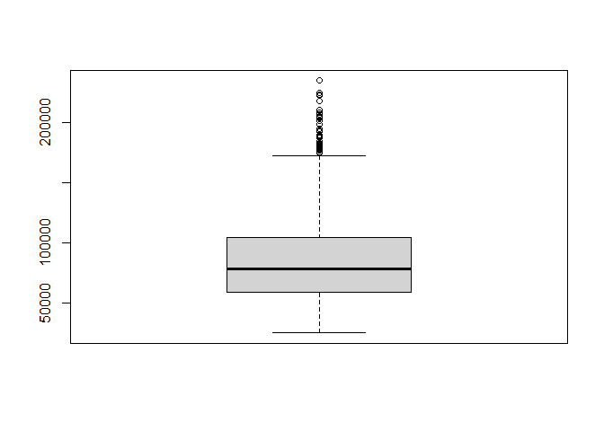<!-- -->


Boxplots (Aim: Identify outliers)


```r
boxplot(data$Area)
```

<!-- -->


```r
boxplot(data$MajorAxisLength)
```

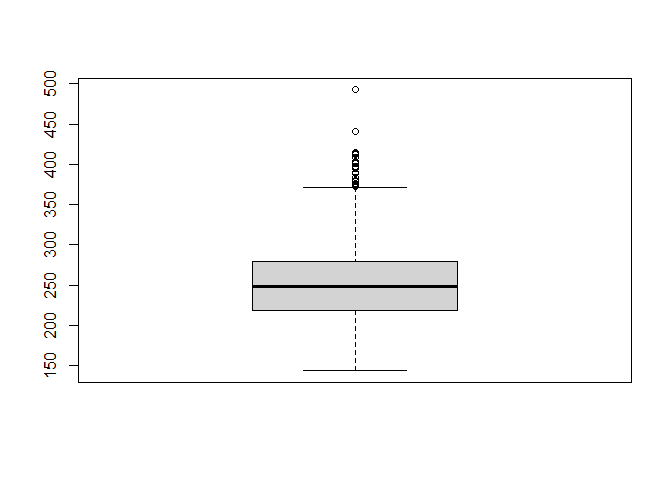<!-- -->


```r
boxplot(data$MinorAxisLength)
```

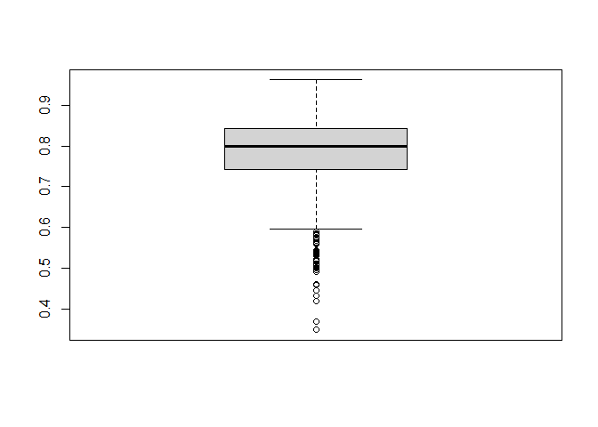<!-- -->


```r
boxplot(data$Eccentricity)
```

<!-- -->


```r
boxplot(data$ConvexArea)
```

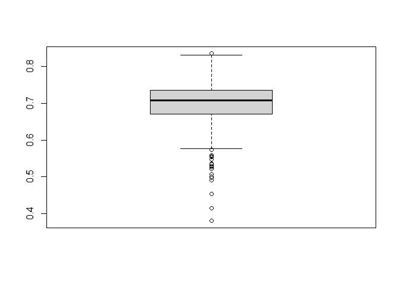<!-- -->


```r
boxplot(data$Extent)
```

<!-- -->


```r
boxplot(data$Perimeter)
```

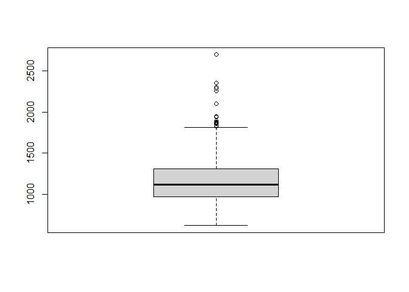<!-- -->


```r
boxplot(data$Class)
```

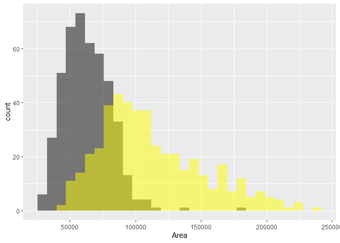<!-- -->


Histograms highlighting class differences (Aim: See if variables' distribution depend on Class)


```r
ggplot() + geom_histogram(data = subset(x=data, subset=Class==1), aes(x = Area), fill = 'black', alpha = 0.5) + geom_histogram(data = subset(x=data, subset=Class==0), aes(x = Area), fill='yellow', alpha = 0.5) 
```

```
## `stat_bin()` using `bins = 30`. Pick better value with `binwidth`.
## `stat_bin()` using `bins = 30`. Pick better value with `binwidth`.
```

<!-- -->


```r
ggplot() + geom_histogram(data = subset(x=data, subset=Class==1), aes(x = MajorAxisLength), fill = 'black', alpha = 0.5) + geom_histogram(data = subset(x=data, subset=Class==0), aes(x = MajorAxisLength), fill='yellow', alpha = 0.5)
```

```
## `stat_bin()` using `bins = 30`. Pick better value with `binwidth`.
## `stat_bin()` using `bins = 30`. Pick better value with `binwidth`.
```

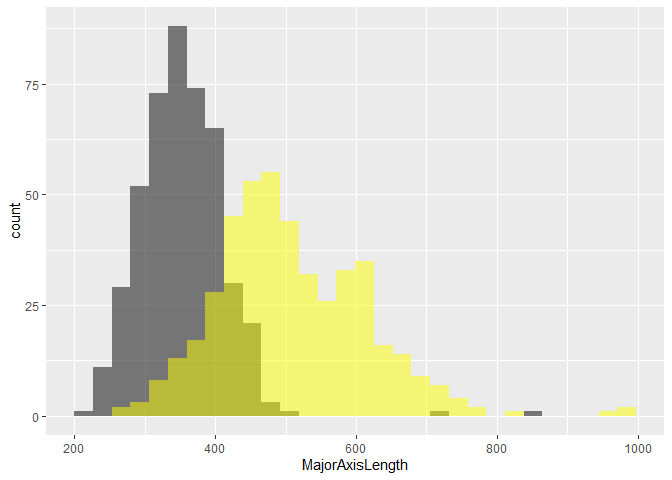<!-- -->


```r
ggplot() + geom_histogram(data = subset(x=data, subset=Class==1), aes(x = MinorAxisLength), fill = 'black', alpha = 0.5) + geom_histogram(data = subset(x=data, subset=Class==0), aes(x = MinorAxisLength), fill='yellow', alpha = 0.5)
```

```
## `stat_bin()` using `bins = 30`. Pick better value with `binwidth`.
## `stat_bin()` using `bins = 30`. Pick better value with `binwidth`.
```

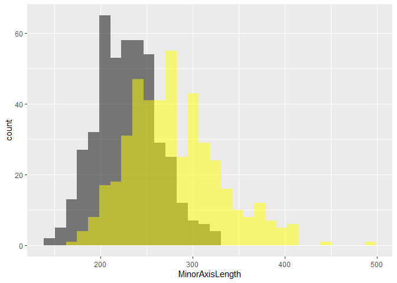<!-- -->


```r
ggplot() + geom_histogram(data = subset(x=data, subset=Class==1), aes(x = Eccentricity), fill = 'black', alpha = 0.5) + geom_histogram(data = subset(x=data, subset=Class==0), aes(x = Eccentricity), fill='yellow', alpha = 0.5)
```

```
## `stat_bin()` using `bins = 30`. Pick better value with `binwidth`.
## `stat_bin()` using `bins = 30`. Pick better value with `binwidth`.
```

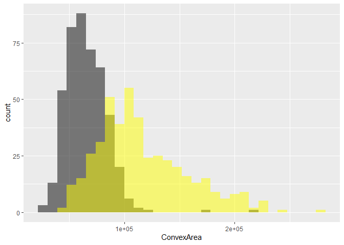<!-- -->


```r
ggplot() + geom_histogram(data = subset(x=data, subset=Class==1), aes(x = ConvexArea), fill = 'black', alpha = 0.5) + geom_histogram(data = subset(x=data, subset=Class==0), aes(x = ConvexArea), fill='yellow', alpha = 0.5)
```

```
## `stat_bin()` using `bins = 30`. Pick better value with `binwidth`.
## `stat_bin()` using `bins = 30`. Pick better value with `binwidth`.
```

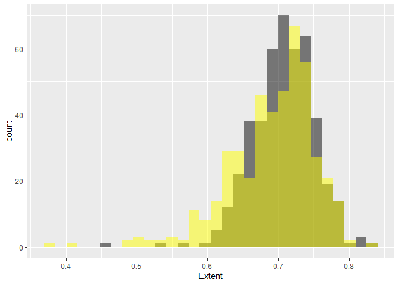<!-- -->


```r
ggplot() + geom_histogram(data = subset(x=data, subset=Class==1), aes(x = Extent), fill = 'black', alpha = 0.5) + geom_histogram(data = subset(x=data, subset=Class==0), aes(x = Extent), fill='yellow', alpha = 0.5)
```

```
## `stat_bin()` using `bins = 30`. Pick better value with `binwidth`.
## `stat_bin()` using `bins = 30`. Pick better value with `binwidth`.
```

<!-- -->


```r
ggplot() + geom_histogram(data = subset(x=data, subset=Class==1), aes(x = Perimeter), fill = 'black', alpha = 0.5) + geom_histogram(data = subset(x=data, subset=Class==0), aes(x = Perimeter), fill='yellow', alpha = 0.5)
```

```
## `stat_bin()` using `bins = 30`. Pick better value with `binwidth`.
## `stat_bin()` using `bins = 30`. Pick better value with `binwidth`.
```

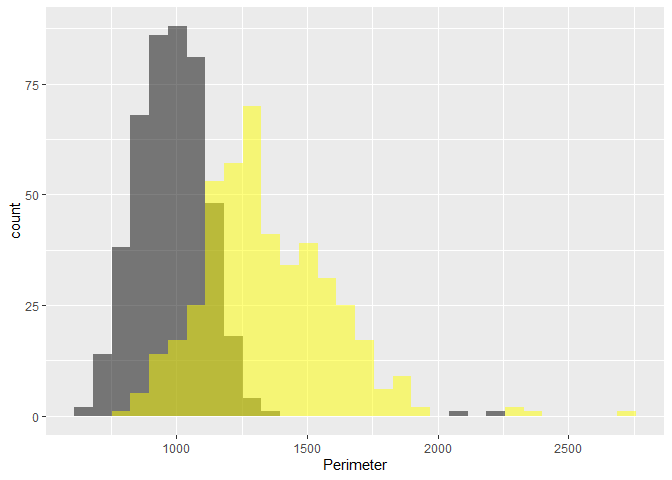<!-- -->


